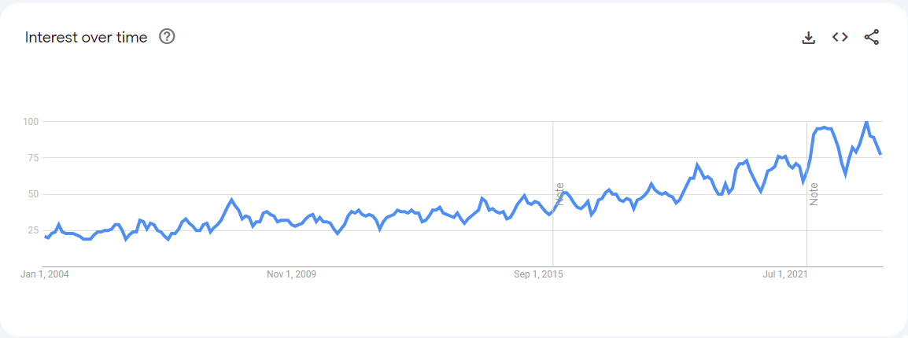

# Naan Mudhalvan Data Analytics
## Solar Panel Data Analytics
In this modern world, The awareness to use solar panel has been increasing 

Looking at the Google Search Trends we can stipulate that Solar Panels have made a an impact in the modern world. Trying to look at the Data collected from them can provide us with more insights and Information that we can use to further improve the use of the Solar Panels. Here's a Data Analytics done to Identify the Underlying Pattern and Relationships in the Solar Panel Forecasting.

## Team

| Name | Register Number     | Github Links                      |
| :-------- | :------- | :-------------------------------- |
| Joab Eliot G | 211520243022 |  |
| Joshee V Y      | 211520243023 |  |
| Sai Rhaghav R S   | 211520243048 |  |
| Jagadeesh     | 211520243020 |  |

